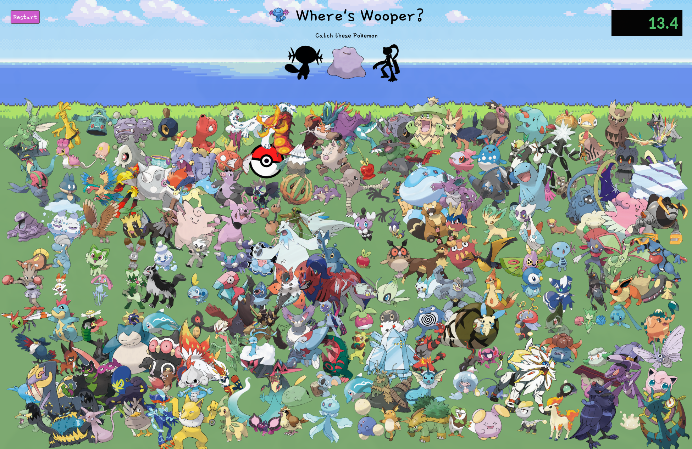

# Where's Wooper

Where's Wally but with randomly generated Pokémon. Fastest times are kept track on a leaderboard. Built with React, Express, PostgreSQL, Prisma ORM, Vite, HTML5, CSS3, and JavaScript (ES6+)

👉 [Live Demo](https://wheres-wooper.pages.dev)

## Acknowledgement

Inspired from [The Odin Project](https://www.theodinproject.com/lessons/nodejs-where-s-waldo-a-photo-tagging-app)

## License

- [MIT License](https://opensource.org/license/MIT)
- Copyright © 2025 Ckyever Gaviola
